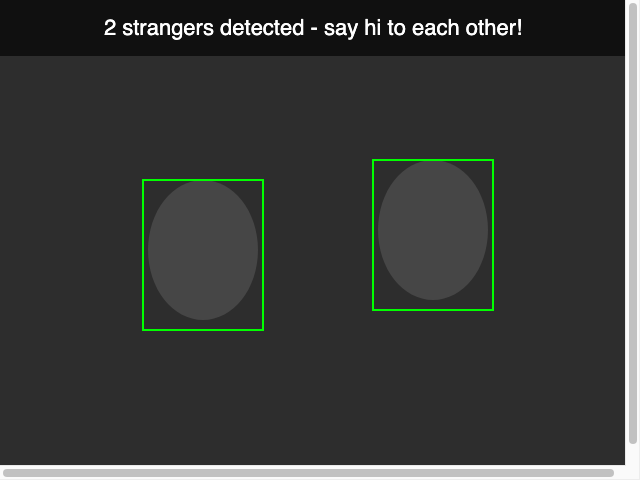

# Computer Vision - Face Icebreaker

My sketch for the **Computer Vision** module (Ambient Computing).

It uses my **webcam** and the **ml5.js** face-detection model to find faces and
draw a green box around each one. My own system (the **challenge**) is a little
**party icebreaker**: it counts how many faces are in view and changes its
message to nudge strangers to say hi.

## How to run it

Webcams only work on a secure page, so use one of these:

- **p5.js web editor** - paste the files in and press play, **or**
- **a local server** (not just double-clicking the file):

```bash
cd computer-vision
python3 -m http.server 8000
```

then open `http://localhost:8000` in **Chrome** and **allow camera access**.
The ml5 face model takes a few seconds to load the first time (watch the console
for `Face API Ready!`).

## What the icebreaker does

- **0 faces:** "Step in front of the camera..."
- **1 face:** "1 person here - waiting for a stranger to join!"
- **2+ faces:** "N strangers detected - say hi to each other!"

This is the assignment's example idea: place the camera where you want strangers
to meet, and the system reacts when faces show up.

## What I did (assignment checklist)

- Set up the webcam with `createCapture(VIDEO)` and drew it with `image()`.
- Loaded the **ml5 Face API** (`ml5.faceApi`) and detected faces in a loop with
  `faceApi.detect()`.
- Drew a green `rect()` around each detected face from `alignedRect._box`.
- **Challenge - my own system:** an icebreaker that counts faces and shows a
  different message depending on how many people are in view.

## Note on versions

I used **p5 1.4.0** and **ml5 0.4.3** (the versions from the tutorial), because
the newer ml5 changed/removed `faceApi`. The ml5 link points at unpkg since the
cdnjs link in the tutorial is no longer available.

## Preview

This is a mock of the on-screen overlay (the real version shows your live webcam
behind the green boxes):


