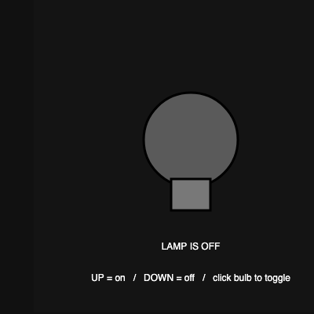
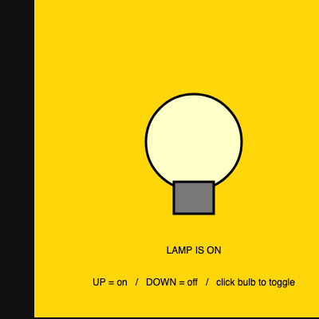

# Webhooks - P5 + IFTTT Smart Lamp

My sketch for the **Webhooks: Connecting IFTTT and P5** module (Ambient Computing).

It is a little smart-lamp controller. Pressing the **UP arrow** sends a webhook
to IFTTT that turns my smart plug **ON**, and the **DOWN arrow** turns it
**OFF**. My "new way" twist: I drew a lightbulb you can also **click** to toggle
the lamp, and the whole canvas glows yellow when the lamp is on so I can see the
state on screen.

## How the connection works

```
P5.js (httpGet request)  ->  IFTTT Webhook (trigger)  ->  Kasa smart plug (action)
```

## How to run it

1. Put your IFTTT Webhooks key in `config.js` (see below).
2. Open `index.html` in a browser (or paste `sketch.js` into the
   [p5.js web editor](https://editor.p5js.org/)).
3. Press **UP** / **DOWN**, or **click the bulb**, to turn the lamp on and off.
   Open the console to see the `sent turn_on` / `sent turn_off` messages.

## IFTTT recipe I made

1. **IFTTT > Create**.
2. **"If This"** -> search **Webhooks** -> **Receive a web request**.
   - Event name for ON: `turn_on`
   - (a second applet uses event name `turn_off`)
3. **"Then That"** -> **Kasa TP-Link** -> turn the plug on (and off for the
   second applet).
4. Got my key from **My Services > Webhooks > Documentation**.

The webhook URL my sketch builds looks like:

```
https://maker.ifttt.com/trigger/turn_on/with/key/MY_KEY
```

## Keeping my key secret

My real key lives in `config.js`, which is listed in `.gitignore`, so it is
**not** uploaded to GitHub (same as I did for the weather widget). To run this,
make your own `config.js`:

```js
const config = {
  IFTTT_KEY: "PASTE_YOUR_IFTTT_WEBHOOKS_KEY_HERE"
}
```

## What I did (assignment checklist)

- Used `keyPressed()` with `UP_ARROW` / `DOWN_ARROW` like the tutorial.
- Built the webhook URL by joining strings and sent it with `httpGet(...)`.
- Made two IFTTT events (`turn_on`, `turn_off`) so I can turn the plug on/off.
- **New way:** added `mousePressed()` so clicking the bulb also triggers the
  webhook, and drew an on-screen lightbulb that glows with the lamp state.
- Used `print()` to confirm each request in the console.

## Preview

Lamp OFF | Lamp ON
:---:|:---:
 | 
