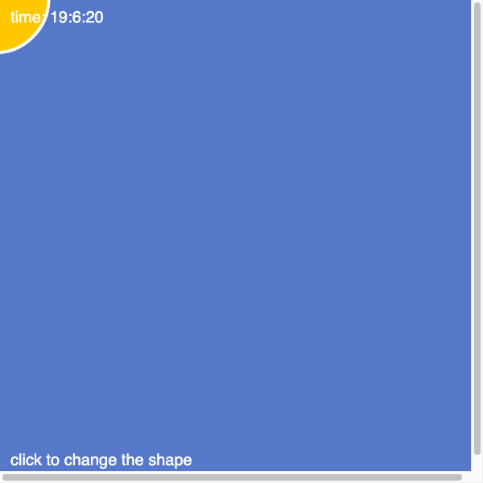

# P5 Intro - Time of Day Mood Light

My sketch for the **P5.js Intro** module (Ambient Computing).

It is a little "mood light" inspired by the student examples in the tutorial
(like Yanan Zhou's *Day Times*). The background color slowly changes with the
clock, a glowing shape follows my mouse like a light, and a tiny clock shows
the current time.

## How to run it

1. Open `index.html` in a browser (or paste `sketch.js` into the
   [p5.js web editor](https://editor.p5js.org/)).
2. Move your mouse around to move the light.
3. **Click** anywhere to switch the shape between a circle and a square.

## What I did (assignment checklist)

- **setup() and draw()** - `createCanvas` runs once in setup, everything that
  moves is in the draw loop.
- **Colors** - the `background()` changes color over time, and I gave the shape
  a warm yellow `fill()` with a white `stroke()`. (The yellow background
  challenge would be `background(255, 255, 0);`.)
- **Shape** - I can draw either an `ellipse()` or a `rect()`.
- **Time** - I use `second()` to change the background color and `millis()` to
  make the shape grow and shrink.
- **Advanced** - I added `mousePressed()` (a new function not in the tutorial)
  to switch shapes, and `text()` to show a little clock.
- I also used `print(second());` to watch the seconds change in the console.

## Preview

To document it live I recorded the screen with Giphy Capture as the tutorial
suggested.
