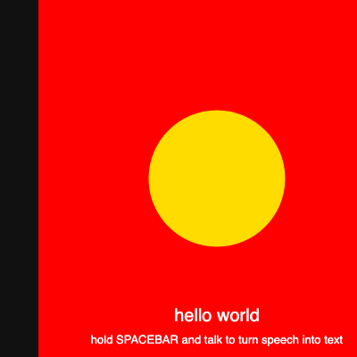

# Sounds, Speech & Macros - P5

My sketch for the **Sounds, Speech, and Macros** module (Ambient Computing).

It is one little "sound playground" that does all four things from the module:

1. **Detect sound** - it listens to my microphone and grows a yellow circle with
   the volume. **(Challenge)** The background turns **red** when it gets loud and
   stays black when it is quiet.
2. **Make sound** - a **Play sound** button plays a sound file, and I set the
   volume with `setVolume()`. **(Challenge)**
3. **Text to speech** - a **Speak** button makes the computer talk out loud.
4. **Speech to text** - holding the **SPACEBAR** turns what I say into text on
   the screen.

## How to run it

1. Open `index.html` in **Chrome** (or paste the files into the
   [p5.js web editor](https://editor.p5js.org/)).
2. **Allow microphone access** when the browser asks (needed for parts 1 and 4).
3. Make a sound near your mic to grow the circle / turn it red.
4. Click **Play sound** to hear the tone, click **Speak** to hear the computer
   talk, and **hold SPACEBAR** and talk to see your words appear.

> Tip: browsers only start audio after a click, so click the page once first.
> Speech-to-text uses `webkitSpeechRecognition`, which works best in Chrome.

## What I did (assignment checklist)

- Used `p5.AudioIn()` + `mic.getLevel()` and `map()` to size the circle.
- **Challenge 1:** an `if/else` changes the background color based on the volume.
- Used `preload()` + `loadSound()` to load `sound.wav`, and `play()` to play it.
- **Challenge 2:** a button triggers the sound and I control the volume with
  `setVolume()` (change the number to make it louder/quieter).
- Used `SpeechSynthesisUtterance` + `speechSynthesis.speak()` for text to speech.
- Used `webkitSpeechRecognition` with `keyPressed()` / `keyReleased()` on the
  spacebar for speech to text.

## Note about the sound file

`sound.wav` is a short tone I included so the **Play sound** button works without
uploading anything. Swap in any other `.wav` to change the sound.

## Preview

This shows the "loud" state - a red background with the circle grown big (the
circle and background react to my real mic when running live):

